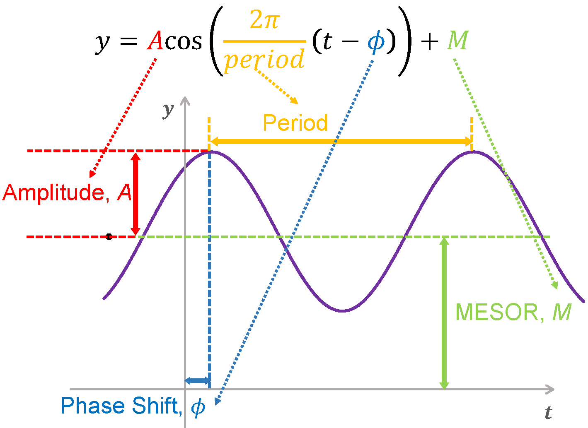
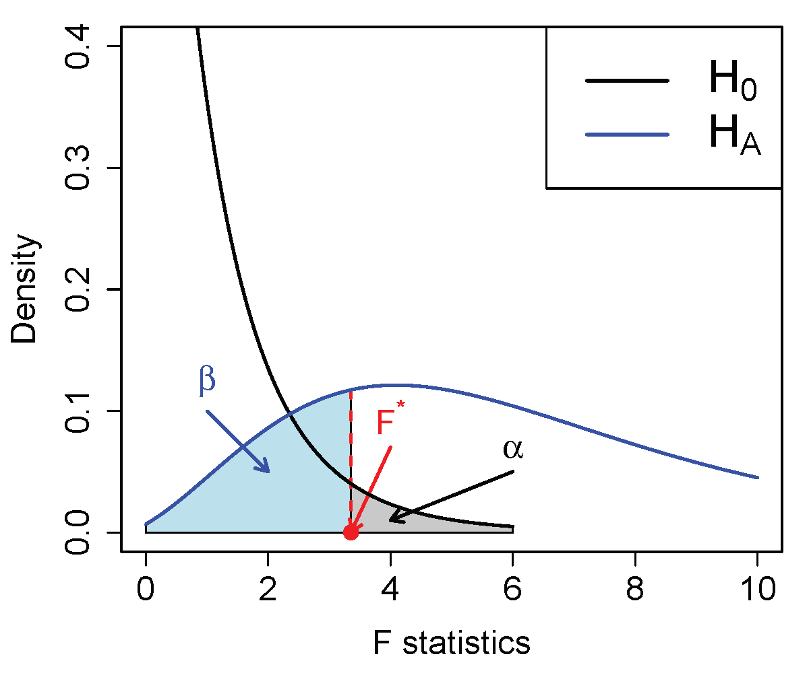
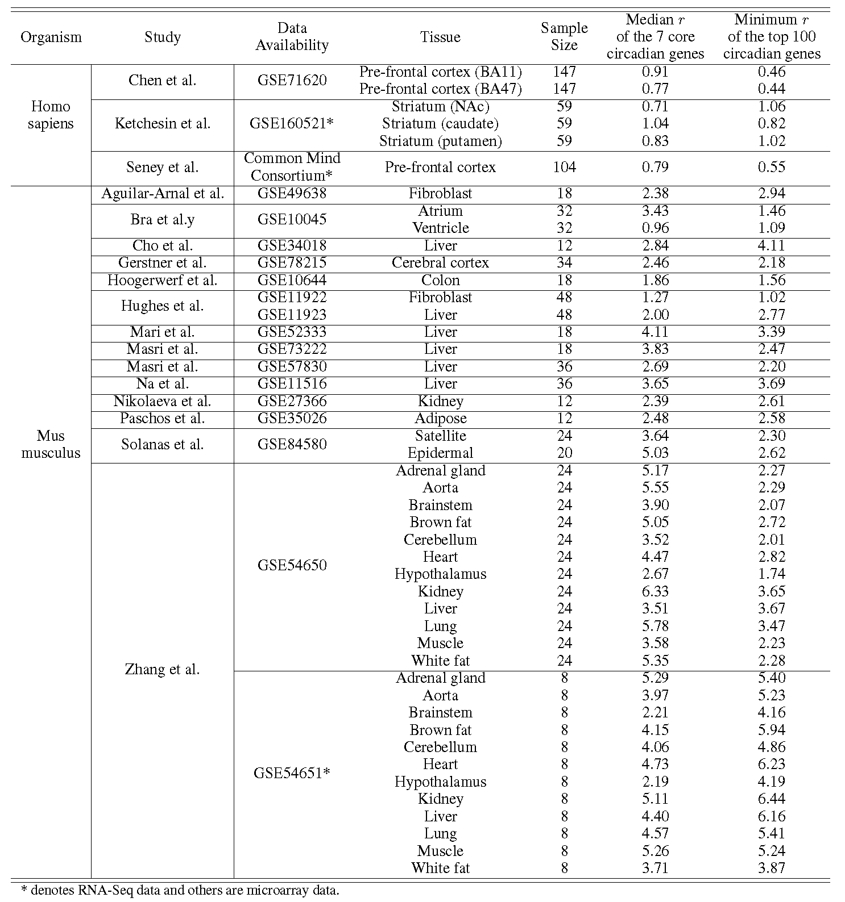

```{r, include = FALSE}
knitr::opts_chunk$set(
  collapse = TRUE,
  comment = "#>"
)
```

```{r setup, eval=FALSE}
```


# Introduction

## Background

Circadian clocks are 24-hour endogenous oscillators in physiological and behavioral processes. Though recent transcriptomic studies have been successful in revealing the circadian rhythmicity in gene expression, the power calculation and study design for omics circadian analysis have not been explored.
Thus we developed an analytical framework for statistical power calculation in circadian gene detection analysis (namely CircaPower).

In terms of study design, 
we consider two types of sampling design: passive or active sampling design. 
In passive design, investigators have no control of the collected circadian time. Such a passive design is commonly seen in studies with human tissues that are difficult to obtain e.g., post-mortem brain tissues (@chen2016effects, @li2013circadian, @seney2019diurnal). In contrast, investigators have full control of the sample collection time in an active sampling design. Such an active design is commonly seen in animal studies (@zhang2014circadian) or human blood studies (@moller2013effects).


## Statistical method
The sinusoidal wave curve assumed in the cosinor model (@cornelissen2014cosinor) is illustrated in Figure 1, where y is the expression value for a gene, t is the Zeitgeber time (ZT; standardized diurnal time with ZT0 for the beginning of day and ZT12 for the beginning of night), M is the MESOR (Midline Estimating Statistic Of Rhythm, a rhythm-adjusted mean), A is the amplitude and $\phi$ is the phase shift. $\omega$ is the frequency of the sinusoidal wave i.e, $\omega = \frac{2\pi}{Period}$. Without loss of generality, we set $period = 24$ hours to mimic the diurnal period. 

For a given sample $i$ ($1\le i \le n$, $n$ is the total number of samples), denote by $y_i$ the expression value of a gene and 
$t_i$ the observed ZT. 
We assume sinusoidal wave function:

\begin{equation}
\label{eq:sin1}
y_i=A\cos(\omega(t_i-\phi))+M+\varepsilon_i, 
\end{equation}

\noindent where $\varepsilon_i$ is the error term for sample $i$; 
we assume $\varepsilon_i$'s are identically and independently distributed ($i.i.d.$) from $\varepsilon_i \sim  \textit{N}(0, \sigma^2)$, 
where $\sigma$ is the noise level. 

```{r ,echo = FALSE,out.width='50%',fig.align="center",fig.cap="Figure 1: The sinusoidal wave curve underlying circadian rhythmicity power calculation framework."}

```

Based on this linear model framework, we could derive a F test statistic $F^{stat}$.
From the linear model theory, under the null hypothesis that there is no circadian rhythmicity (i.e., $A=0$),
$$F^{stat} \sim f_0(\cdot|2, n - 3),$$
where $2$ and $n-3$ are the degrees of freedom of the $F$ distribution, and $f_0$ denotes a regular $F$ distribution with non-centrality parameter $0$.


Under the alternative hypothesis that there exists circadian rhythmicity pattern (i.e., $A \ne 0$), 
$$F^{stat} \sim  f_\lambda(\cdot|2,n-3)$$
where $2$ and $n-3$ are the degrees of freedom of the $F$ distribution, and $f_\lambda$ denotes a non-central $F$ distribution with non-centrality parameter $\lambda$, with $\lambda  = \frac{nA^2 }{\sigma^2} [\frac{1}{n}\sum_i \cos^2(w(t_i - \phi)) - (\frac{1}{n}\sum_i\cos(\omega(t_i-\phi)))^2]$. 


Figure 2 shows the relationship between the null and alternative distributions. By assuming the rejection boundary is at alpha level $\alpha$, the relationship between $\alpha$ and the power $1-\beta$ is:
$$F_{\lambda}^{-1} (\beta| 2 , n - 3) = F_0^{-1} (1 - \alpha| 2 , n - 3)$$
\noindent where $F_\lambda (x| df_1 , df_2)$ and $F_0 (x| df_1 , df_2)$ are the cumulative density function of $f_\lambda (\cdot|df_1 , df_2)$ and $f_0 (\cdot|df_1 , df_2)$ evaluated at $x$ respectively. Therefore, the power $1=\beta$ can be derived from the equation above.


```{r,echo = FALSE,out.width='50%',fig.align="center",fig.cap="Figure 2: the relationship between power and type I control in detecting circadian rhythmicity. Black curve: the density function of the F statistics under the null distribution; Blue curve: the density function of the F statistics under the alternative distribution; Red dashed line: the decision boundary (i.e., $F^*$)."}

```

Under fixed type I error control $\alpha$, the detection power depends on the total effect size $\lambda$ which can be decomposed into three factors: (1) **sample size $n$**; (2) **intrinsic effect size $r=A/\sigma$**; (3) **sampling design factor $d = \frac{1}{n}\sum_i \cos^2(w(t_i - \phi)) - (\frac{1}{n}\sum_i\cos(\omega(t_i-\phi)))^2$**. In our paper, we show that for active design (i.e. evenly spaced ZT distribuiton), the sampling design factor $d$ is a constant of $\frac{1}{2}$ independent of the $\phi$ as long as the number of sampling times is greater or equal to 3 (i.e., phase-invariant property).

## About this tutorial

This is a tutorial for the usage of the CircaPower package.
The major contents of this tutorial includes:

- Circadian power calculation (active design) when the circadian times are evenly spaced.
- Circadian power calculation (passive design) given irregular circadian time distribuiton.
- A case study how to perform circadian power calculation using mouse skeletal muscle pilot data.
- Intrinsic effect size from public databases.


# About the package

## How to install the package

To install this package, start R (version "3.0" or above) and enter:

```{r, eval=FALSE}
library(devtools)
install_github("https://github.com/circaPower/CircaPower") 
```

## How to cite the package


- Wei Zong, Marianne L. Seney, Kyle D. Ketchesin, Michael T. Gorczyca, Andrew C. Liu, Karyn A. Esser, George C. Tseng*, Colleen A. McClung* and Zhiguang Huo*. Experimental Design and Power Calculation in Omics Circadian Rhythmicity Detection. (Submitted, *: co-coresponding authors)

- The manuscript can be found here: to be updated

## Maintainer

Wei Zong (wez97@pitt.edu) and Zhiguang Huo (zhuo@ufl.edu)


# Examples

## 1. Circadian power calculation (active design) when the circadian times are evenly spaced.

In an active sampling design, investigators have full control of the sample collection time.
For a typical active design,
researchers usually need to control (i) the number of ZT points per cycle, 
(ii) the number of replicated samples at each time point within a cycle, 
and (iii) the number of cycles.
Because of the periodicity property of the sinusoidal curve in the cosinor model,
the number of replicated samples at each time point within a cycle and the number of cycles are equivalent in the sense that 
2 replicated samples at each time point across 1 cycle will result in the same statistical estimation with only one sample at each time point across 2 cycles.
Therefore, for the ease of discussion, 
we summarize the following two key parameters for an active design:
(i) number of ZT points $N_T$ per cycle;
(ii) total number of samples $n$.
The number of replicated samples (at the same ZT across all cycles) could be calculated as $n/N_T$.
Because of the phase invariant property of evenly-spaced sampling design, the detection power only depends on the total number of samples $N_T$ and intrinsic effect size r given type I error control level $\alpha$.  
```{r, eval=TRUE}
library(CircaPower)

## Calculate power given (1) sample size n, (2) intrinsic effect size r, and (3) alpha level
CircaPower(n=12, r=1.5, alpha = 0.05)

## Calculate sample size given (1) pre-specified power, (2) intrinsic effect size r, and (3) alpha level
CircaPower(power=0.8, r=1.5, alpha = 0.05)

```
  
## 2. Circadian power calculation (passive design) given irregular circadian time distribuiton.

In terms of study design, 
we consider two types of sampling design: passive or active sampling design. 
In passive design, investigators have no control of the collected circadian time. Such a passive design is commonly seen in studies with human tissues that are difficult to obtain e.g., post-mortem brain tissues.
Under this scenario, the sampling design factor d is dependent on the phase value $\phi$ which needs to be pre-specified. 

When the number of given irregular circadian times is different from the desired sample size, our package provides two estimation approaches for estimating the sampling design factor d in power calculation: 

(1) ct_estimation="expected" where d is calculated from the cts provided directly; 
(2) ct_estimation = "sampling" where n circadian times are first draw from the kernel density estimated from the empirical distribution of the cts provided and the n circadian times will be used for caclculating d.


```{r, eval=TRUE}
library(CircaPower)

## Use observed time of death from the human post-mortem brain transcriptomic study on Brodmann's area 11 and 47 in the prefrontal cortex as an example.
data(cts_Chen)

## Calculate power given (1) sample size n, (2) intrinsic effect size r, (3) phase value phi, (4) irregular circadian times cts and (5) alpha level using cts provided for estimating d.
CircaPower(n=100, r=0.4, phi=0, cts=cts_Chen, ct_estimation="expected", alpha = 0.05)

## Calculate power given (1) sample size n, (2) intrinsic effect size r, (3) phase value phi, (4) irregular circadian times cts and (5) alpha level using sampling approach for estimating d.
CircaPower(n=100, r=0.4, phi=0, cts=cts_Chen, ct_estimation="sampling", alpha = 0.05)

```
  
For the inverse problem of deriving sample size given pre-specified power, the "expected" approach is used for estimating d.
```{r, eval=TRUE}
## Calculate sample size given (1) pre-specified power, (2) intrinsic effect size r, (3) phase value phi, (4) irregular circadian times cts and (3) alpha level.
CircaPower(power=0.75, r=0.4, phi=0, cts=cts_Chen, alpha = 0.05)

```

## 3. A case study how to perform circadian power calculation using mouse skeletal muscle pilot data.

To demonstrate how to perform circadian power calculation using pilot dataset from scratch,
we utilize a circadian gene expression data in mouse with skeletal muscle, which is part of the mouse pan-tissue gene expression circadian microarray data (@zhang2014circadian).
Detailed description of this dataset has been described in previous literature (@hodge2015endogenous).
Briefly, 
24 mouse muscle samples were collected (every 2 hours) across 2 full cycles.
The data can be loaded using the following way:

```{r}
library(CircaPower)
data(mus_expr)
data(mus_pheno)
stopifnot(colnames(mus_expr) == mus_pheno$geo_accession)
dim(mus_expr)
head(mus_pheno)
```


With this pilot data, we perform genome-wide circadian rhythmicity detection using the cosinor method (@dinglikelihood). This step may take 30 seconds.

```{r}
library(diffCircadian)

tt <- mus_pheno$CT
i <- 1

thisResult <- data.frame(genes = rownames(mus_expr), 
	amp =NA, phase = NA, peakTime = NA, basal = NA, sigmaA2=NA, R2 = NA, pvalue = NA
)

for(gg in 1:nrow(mus_expr)){
	if(gg %% 1000 == 0){
		#print(gg)
	}
	yy <- mus_expr[gg, ]
	aFtest <- LR_rhythmicity(tt, yy) ## Wald test
	
	thisResult$amp[gg] <- aFtest$amp
	thisResult$phase[gg] <- aFtest$phase
	thisResult$peakTime[gg] <- (6 - aFtest$phase) %% 24
	thisResult$basal[gg] <- aFtest$offset
	thisResult$sigmaA2[gg] <- aFtest$sigmaA2
	thisResult$R2[gg] <- aFtest$R2
	thisResult$pvalue[gg] <- aFtest$pvalue
}
thisResult <- thisResult[order(thisResult$pvalue),] 
```

Under $p<0.001$, we identify 716 significant genes showing circadian pattern.

```{r}
sum(thisResult$pvalue < 0.001)
```

We similarly estimate the intrinsic effect sizes for:
(i) median $r$ of the 7 core circadian genes;
(ii) minimum $r$ of the top 100 significant circadian genes.

```{r}
coreCircadianGenes <- c("Arntl", "Dbp", "Nr1d1", "Nr1d2", "Per1", "Per2", "Per3")
thisResult_core7 <- thisResult[thisResult$genes %in% coreCircadianGenes,]
r_core7 <- thisResult_core7$amp/sqrt(thisResult_core7$sigmaA2)
print(median(r_core7))

  
thisResult_top100 <- thisResult[1:100,] ## please make sure this result is sorted by p-value
r_top100 <- thisResult_top100$amp/sqrt(thisResult_top100$sigmaA2)
print(min(r_top100))
```

The resulting intrinsic effect sizes are 3.58 and 2.23 respectively. 
By assuming different $\alpha$ to be 0.05, 0.01, 0.001,
the power curves with respect to sample size are shown in Figure~S4. We observe that $n=12$
can achieve 97.1\% and 50.5\% detection power for the two intrinsic effect sizes at $\alpha=0.001$. 


We first estimate the intrinsic effect sizes from this pilot data for: (i) median r of the 7 core circadian genes; (ii) minimum r of the top 100 significant circadian genes. The resulting intrinsic effect sizes are 3.58 and 2.23 respectively. Then, we can calculate the power at any desired sample size by inserting these estimated r.

```{r, eval=TRUE}
## Calculate power using the median r of the 7 core circadian genes
CircaPower(n=12, r=3.58, alpha = 0.05)

## Calculate power using the minimum r of the top 100 significant circadian genes
CircaPower(n=12, r=2.23, alpha = 0.05)

```

## 4. Intrinsic effect size from public databases.
We obtain the estimated intrinsic effect sizes from 3 publicly available human (@chen2016effects, @ketchesin2021diurnal and @seney2019diurnal) and 14 mouse (@aguilar2013cycles, @bray2008disruption, @cho2012regulation, @gerstner2016removal, @hoogerwerf2008transcriptional, @hughes2009harmonics, @mari2016gut, @masri2016lung, @masri2014partitioning, @na2009comprehensive, @nikolaeva2012circadian, @paschos2012obesity, @solanas2017aged, @zhang2014circadian) transcriptomic circadian studies. When a user needs to perform power calculation without pilot data, information from these public data can be used as a reference resource to facilitate circadian power calculation.


```{r ,echo = FALSE,out.width='100%',fig.cap="Table1: Intrinsic effect sizes for public available transcriptomic circadian data, including 3 passively designed human postmortem brain studies and 14 actively designed mouse studies from 20 types of tissues. These data are processed using the cosinor method (Cornelissen (2014)). Two types intrinsic effect sizes are used: (i) median $r$ of the 7 core circadian genes; (ii) minimum $r$ of the top 100 significant circadian genes."}

```

***
# References