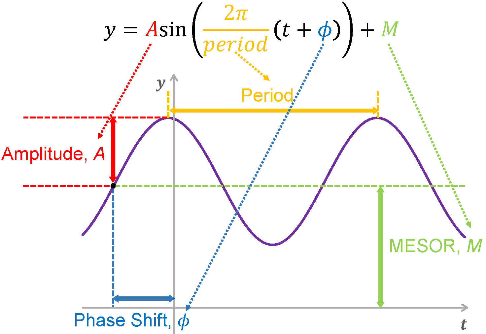

```{r, include = FALSE}
knitr::opts_chunk$set(
  collapse = TRUE,
  comment = "#>"
)
```

```{r setup, eval=FALSE}
library(CircaPower)
```


# Introduction

## Background

Circadian clocks are 24-hour endogenous oscillators in physiological and behavioral processes. Though recent transcriptomic studies have been successful in revealing the circadian rhythmicity in gene expression, the power calculation and study design for omics circadian analysis have not been explored. CircaPower is an analytical framework for statistical power calculation in circadian gene detection analysis. It is based on the cosinor model, which is the only rhythmicity detection model with explicitly defined effect size and data variability and allows for irregular Zeitgeber time (ZT; standardized diurnal time with ZT0 for the beginning of day and ZT12 for the beginning of night) distribution. CircaPower is designed for fast and accurate power caculation for both passive and active sampling design. In passive design, investigators have no control of the collected ZT. Such a passive design is commonly seen in studies with human tissues that are difficult to obtain (e.g., post-mortem brain tissues). In contrast, investigators have full control of the sample collection time in an active sampling design. Such an active design is commonly seen in
animal studies or human blood studies.


## Statistical method
The sinusoidal wave curve assumed in the cosinor model is illustrated in Figure 1, where y is the expression value for a gene, t is the ZT, M is the MESOR (Midline Estimating Statistic Of Rhythm, a rhythm-adjusted mean), A is the amplitude and $\phi$ is the phase shift. $\omega$ is the frequency of the sinusoidal wave i.e, $\omega = \frac{2\pi}{Period}$. Without loss of generality, we set $period = 24$ hours to mimic the diurnal period. \\

For a given sample $i$ ($1\le i \le n$, $n$ is the total number of samples), denote by $y_i$ the expression value of a gene and 
$t_i$ the observed ZT. 
We assume sinusoidal wave function:

\begin{equation}
\label{eq:sin1}
y_i=A\sin(\omega(t_i+\phi))+M+\varepsilon_i, 
\end{equation}

\noindent where $\varepsilon_i$ is the error term for sample $i$; 
we assume $\varepsilon_i$'s are identically and independently distributed ($i.i.d.$) from $\varepsilon_i \sim  \textit{N}(0, \sigma^2)$, 
where $\sigma$ is the noise level. 

```{r ,echo = FALSE,out.width='50%',fig.align="center",fig.cap="Figure 1: The sinusoidal wave curve underlying circadian rhythmicity power calculation framework."}

```

Equivalently, we could re-write the model as 

\begin{equation}
\label{eq:sin2}
y_i=E\sin(\omega t_i) + H\cos(\omega t_i) +M+\varepsilon_i, 
\end{equation}

\noindent where $E = A \cos (\omega \phi)$, and $H = A \sin (\omega \phi)$. It turns into a linear regression problem with the corresponding F statistics as $F^{stat} = \frac{\frac{TSS - RSS}{r - 1}}{\frac{RSS}{n-r}}$ where where $RSS = \sum^n_{i=1} (y_i-\hat{y_i})^2$, $TSS = \sum^n_{i=1} (y_i-\bar{y})^2$, $\hat{y_i} = \hat{A} \sin(\omega(t_i+\hat{\phi})) + \hat{M}$, $\bar{y} = \sum_i y_i / n$, with $\hat{A}$, $\hat{\phi}$, and  $\hat{M}$ estimated under least squared loss.\

\

From the linear model theory, under the null hypothesis that there is no circadian rhythmicity, i.e., $A=0$, or equivalently, $E=H=0$,
$$F^{stat} \sim f_0(\cdot|2, n - 3),$$
where $2$ and $n-3$ are the degrees of freedom of the $F$ distribution, and $f_0$ denotes a regular $F$ distribution with non-centrality parameter $0$.\

\

Under the alternative hypothesis that there exists circadian rhythmicity pattern, i.e., $A \ne 0$, or equivalently, $E\ne 0$ or $H\ne 0$, 
$$F^{stat} \sim  f_\lambda(\cdot|2,n-3), \lambda  = \frac{A^2 }{\sigma^2} \sum_i \sin^2(w(t_i + \phi))$$
where $2$ and $n-3$ are the degrees of freedom of the $F$ distribution, and $f_\lambda$ denotes a non-central $F$ distribution with non-centrality parameter $\lambda$.\

\

Figure 2 shows the relationship between the null and alternative distributions. By assuming the rejection boundary is at alpha level $\alpha$, the relationship between $\alpha$ and the power $1-\beta$ is:
$$F_{\lambda}^{-1} (\beta| 2 , n - 3) = F_0^{-1} (1 - \alpha| 2 , n - 3)$$
\noindent where $F_\lambda (x| df_1 , df_2)$ and $F_0 (x| df_1 , df_2)$ are the cumulative density function of $f_\lambda (\cdot|df_1 , df_2)$ and $f_0 (\cdot|df_1 , df_2)$ evaluated at $x$ respectively. Therefore, the power $1=\beta$ can be derived from the equation above.


```{r,echo = FALSE,out.width='50%',fig.align="center",fig.cap="Figure 2: the relationship between power and type I control in detecting circadian rhythmicity. Black curve: the density function of the F statistics under the null distribution; Blue curve: the density function of the F statistics under the alternative distribution; Red dashed line: the decision boundary (i.e., $F^*$)."}
knitr::include_graphics("power_Ftest.png")
```

Under fixed type I error control $\alpha$, the detection power depends on the total effect size $\lambda$ which can be decomposed into three factors: (1) sample size $n$; (2) intrinsic effect size $r=A/\sigma$; (3) sampling design factor $d = \frac{1}{n}\sum_{i=1}^n \sin^2(w(t_i + \phi))$. In our paper, we show that for active design (i.e. evenly spaced ZT distribuiton), the sampling design factor $d$ is a constant of $\frac{1}{2}$ independent of the $\phi$ as long as the number of sampling times is greater or equal to 3 (i.e., phase-invariant property).

## About this tutorial

This is a tutorial for the usage of the CircaPower package.
The major contents of this tutorial includes:

- Circadian power calculation (active design) when the ZT are evenly spaced.
- Circadian power calculation (passive design) given irregular ZT distribuiton.
- A case study how to perform circadian power calculation using mouse skeletal muscle pilot data.
- Intrinsic effect size from public databases.


# About the package

## How to install the package

To install this package, start R (version "3.0" or above) and enter:

```{r, eval=FALSE}
library(devtools)
install_github("https://github.com/circaPower/CircaPower") 
```

## How to cite the package


- Wei Zong, Marianne L. Seney, Kyle D. Ketchesin, Michael T. Gorczyca, Andrew C. Liu, Karyn A. Esser, George C. Tseng*, Colleen A. McClung* and Zhiguang Huo*. Experimental Design and Power Calculation in Omics Circadian Rhythmicity Detection. (Submitted, *: co-coresponding authors)

- The manuscript can be found here: to be updated

## Maintainer

Wei Zong (wez97@pitt.edu) and Zhiguang Huo (zhuo@ufl.edu)


# Examples

## 1. Circadian power calculation (active design) when the circadian times are evenly spaced.

Because of the phase invariant property of evenly-spaced sampling design, the detection power only depends on the total number of samples n and intrinsic effect size r given type I error control level $\alpha$.  
```{r, eval=FALSE}
library(CircaPower)

## Calculate power given (1) sample size n, (2) intrinsic effect size r, and (3) alpha level
CircaPower(n=12, r=1.5, alpha = 0.05)

## Calculate sample size given (1) pre-specified power, (2) intrinsic effect size r, and (3) alpha level
CircaPower(power=0.8, r=1.5, alpha = 0.05)

```
  
## 2. Circadian power calculation (passive design) given irregular circadian time distribuiton.

For irregular circadian time distribuiton, the sampling design factor d is dependent on the phase value $\phi$ which needs to be pre-specified. 

When the number of given irregular circadian times is different from the desired sample size, our package provides two estimation approaches for estimating the sampling design factor d in power calculation: 

(1) ct_estimation="expected" where d is calculated from the cts provided directly; 
(2) ct_estimation = "sampling" where n circadian times are first draw from the kernel density estimated from the empirical distribution of the cts provided and the n circadian times will be used for caclculating d.


```{r, eval=FALSE}
library(CircaPower)

## Use observed time of death from the human post-mortem brain transcriptomic study on Brodmann's area 11 and 47 in the prefrontal cortex as an example.
data(cts_Chen)

## Calculate power given (1) sample size n, (2) intrinsic effect size r, (3) phase value phi, (4) irregular circadian times cts and (5) alpha level using cts provided for estimating d.
CircaPower(n=100, r=0.4, phi=0, cts=cts_Chen, ct_estimation="expected", alpha = 0.05)

## Calculate power given (1) sample size n, (2) intrinsic effect size r, (3) phase value phi, (4) irregular circadian times cts and (5) alpha level using sampling approach for estimating d.
CircaPower(n=100, r=0.4, phi=0, cts=cts_Chen, ct_estimation="sampling", alpha = 0.05)

```
  
For the inverse problem of deriving sample size given pre-specified power, the "expected" approach is used for estimating d.
```{r, eval=FALSE}
## Calculate sample size given (1) pre-specified power, (2) intrinsic effect size r, (3) phase value phi, (4) irregular circadian times cts and (3) alpha level.
CircaPower(power=0.75, r=0.4, phi=0, cts=cts_Chen, alpha = 0.05)

```
## 3. A case study how to perform circadian power calculation using mouse skeletal muscle pilot data.
We first estimate the intrinsic effect sizes from this pilot data for: (i) median r of the 7 core circadian genes; (ii) minimum r of the top 100 significant circadian genes. The resulting intrinsic effect sizes are 3.58 and 2.23 respectively. Then, we can calculate the power at any desired sample size by inserting these estimated r.

```{r, eval=FALSE}
## Calculate power using the median r of the 7 core circadian genes
CircaPower(n=12, r=3.58, alpha = 0.05)

## Calculate power using the minimum r of the top 100 significant circadian genes
CircaPower(n=12, r=2.23, alpha = 0.05)

```

## 4. Intrinsic effect size from public databases.


```{=latex}
\begin{table*}[!htbp]
\caption{Intrinsic effect sizes for public available transcriptomic circadian data, including 3 passively designed human postmortem brain studies and 14 actively designed mouse studies from 20 types of tissues.
These data are processed using the cosinor method \citep{cornelissen2014cosinor}.
Two types intrinsic effect sizes are used: 
(i) median $r$ of the 7 core circadian genes;
(ii) minimum $r$ of the top 100 significant circadian genes.
These intrinsic effect sizes can be used as a reference resource when investigators need to perform power calculation without any pilot data.
}
\begin{center}
\begin{tabular}{ccccccc}
\hline
\hline
Organism                                                                                      & Study                      & \begin{tabular}[c]{@{}c@{}}Data \\ Availability\end{tabular}      & Tissue                                                       & \begin{tabular}[c]{@{}c@{}}Sample \\ Size\end{tabular} & \begin{tabular}[c]{@{}c@{}}Median $r$ \\ of the 7 core \\ circadian genes\end{tabular} & \begin{tabular}[c]{@{}c@{}}Minimum $r$ \\ of the top 100\\  circadian genes\end{tabular} \\ \hline
\multicolumn{1}{c|}{\multirow{6}{*}{\begin{tabular}[c]{@{}c@{}}Homo\\ sapiens\end{tabular}}}  & \multicolumn{1}{c|}{\multirow{2}{*}{Chen \cite{chen2016effects}}}      & \multirow{2}{*}{GSE71620}                                         & Pre-frontal cortex (BA11) & 147                                                    & 0.91                                                                                   & 0.46                                                                                     \\
\multicolumn{1}{c|}{}                                                                         & \multicolumn{1}{c|}{}                           &                                                                   & Pre-frontal cortex (BA47) & 147                                                    & 0.77                                                                                   & 0.44                                                                                     \\\cline{2-7}
\multicolumn{1}{c|}{}                                                                         & \multicolumn{1}{c|}{\multirow{3}{*}{Ketchesin \cite{ketchesin2021diurnal}}} & \multirow{3}{*}{GSE160521*}                                        & Striatum (NAc) & 59                                                     & 0.71                                                                                   & 1.06                                                                                     \\
\multicolumn{1}{c|}{}                                                                         & \multicolumn{1}{c|}{}                           &                                                                   & Striatum (caudate) & 59                                                     & 1.04                                                                                   & 0.82                                                                                     \\
\multicolumn{1}{c|}{}                                                                         & \multicolumn{1}{c|}{}                           &                                                                   & Striatum (putamen) & 59                                                     & 0.83                                                                                   & 1.02                                                                                     \\\cline{2-7} 
\multicolumn{1}{c|}{}                                                                         & \multicolumn{1}{c|}{Seney \cite{seney2019diurnal}}                     & \begin{tabular}[c]{@{}c@{}}Common Mind \\ Consortium*\end{tabular} & Pre-frontal cortex & 104                                                    & 0.79                                                                                   & 0.55                                                                                     \\\hline 
\multicolumn{1}{c|}{}                                                                         & \multicolumn{1}{c|}{Aguilar-Arnal\cite{aguilar2013cycles}}              & GSE49638                                                          & Fibroblast                                                   & 18                                                     & 2.38                                                                                   & 2.94                                                                                     \\\cline{2-7}
\multicolumn{1}{c|}{\multirow{28}{*}{\begin{tabular}[c]{@{}c@{}}Mus\\ musculus\end{tabular}}} & \multicolumn{1}{c|}{\multirow{2}{*}{Bray\cite{bray2008disruption}}}      & \multirow{2}{*}{GSE10045}                                         & Atrium                                                       & 32                                                     & 3.43                                                                                   & 1.46                                                                                     \\
\multicolumn{1}{c|}{}                                                                         & \multicolumn{1}{c|}{}                           &                                                                   & Ventricle                                                    & 32                                                     & 0.96                                                                                   & 1.09                                                                                     \\\cline{2-7}
\multicolumn{1}{c|}{}                                                                         & \multicolumn{1}{c|}{Cho\cite{cho2012regulation}}                        & GSE34018                                                          & Liver                                                        & 12                                                     & 2.84                                                                                   & 4.11                                                                                     \\\cline{2-7}
\multicolumn{1}{c|}{}                                                                         & \multicolumn{1}{c|}{Gerstner\cite{gerstner2016removal}}                   & GSE78215                                                          & Cerebral cortex    & 34                                                     & 2.46                                                                           & 2.18 \\\cline{2-7}
\multicolumn{1}{c|}{}                                                                         & \multicolumn{1}{c|}{Hoogerwerf\cite{hoogerwerf2008transcriptional}}                 & GSE10644                                                          & Colon                                                        & 18                                                     & 1.86                                                                                   & 1.56                                                                                     \\\cline{2-7}
\multicolumn{1}{c|}{}                                                                         & \multicolumn{1}{c|}{\multirow{2}{*}{Hughes \cite{hughes2009harmonics}}}    & GSE11922                                                          & Fibroblast                                                   & 48                                                     & 1.27                                                                                  & 1.02                                                                                     \\
\multicolumn{1}{c|}{}                                                                         &\multicolumn{1}{c|}{}                            & GSE11923                                                          & Liver                                                        & 48                                                     & 2.00                                                                                   & 2.77                                                                                     \\\cline{2-7}
\multicolumn{1}{c|}{}  & \multicolumn{1}{c|}{Mari\cite{mari2016gut}}                   & GSE52333                                                          & Liver                                                        & 18                                                     & 4.11                                                                                   & 3.39                                                                                     \\\cline{2-7}
\multicolumn{1}{c|}{}                                                                         & \multicolumn{1}{c|}{Masri \cite{masri2016lung}} & GSE73222                                                          & Liver                                                        & 18                                                     & 3.83                                                                                   & 2.47                              \\\cline{2-7}
\multicolumn{1}{c|}{}                                                                         & \multicolumn{1}{c|}{Masri \cite{masri2014partitioning}} & GSE57830                                                          & Liver                                                        & 36                                                     & 2.69                                                                                   & 2.20                                                                                     \\\cline{2-7}
\multicolumn{1}{c|}{}                                                                         & \multicolumn{1}{c|}{Na\cite{na2009comprehensive}}                         & GSE11516                                                          & Liver                                                        & 36                                                     & 3.65                                                                                   & 3.69                                                                                     \\\cline{2-7}
\multicolumn{1}{c|}{}                                                                         & \multicolumn{1}{c|}{Nikolaeva\cite{nikolaeva2012circadian}}                  & GSE27366                                                          & Kidney                                                       & 12                                                     & 2.39                                                                                   & 2.61                                                                                     \\\cline{2-7}
\multicolumn{1}{c|}{}                                                                         & \multicolumn{1}{c|}{Paschos\cite{paschos2012obesity}}                    & GSE35026                                                          & Adipose                                                      & 12                                                     & 2.48                                                                                   & 2.58                                                                                     \\\cline{2-7}
\multicolumn{1}{c|}{}                                                                         & \multicolumn{1}{c|}{\multirow{2}{*}{Solanas\cite{solanas2017aged}}}   & \multirow{2}{*}{GSE84580}                                         & Satellite                                                    & 24                                                     & 3.64                                                                                   & 2.30                                                                                     \\
\multicolumn{1}{c|}{}                                                                         &\multicolumn{1}{c|}{}                            &                                                                   & Epidermal                                                    & 20                                                     & 5.03                                                                                   & 2.62                                                                                     \\\cline{2-7}
\multicolumn{1}{c|}{}                                                                         & \multicolumn{1}{c|}{\multirow{24}{*}{Zhang\cite{zhang2014circadian}}}    & \multirow{12}{*}{GSE54650}                                        & Adrenal gland                                                & 24                                                     & 5.17                                                                                   & 2.27                                                                                     \\
\multicolumn{1}{c|}{}                                                                         &\multicolumn{1}{c|}{}                            &                                                                   & Aorta                                                        & 24                                                     & 5.55                                                                                   & 2.29                                                                                     \\
\multicolumn{1}{c|}{}                                                                         &\multicolumn{1}{c|}{}                            &                                                                   & Brainstem                                                    & 24                                                     & 3.90                                                                                   & 2.07                                                                                     \\
\multicolumn{1}{c|}{}                                                                         &\multicolumn{1}{c|}{}                            &                                                                   & Brown fat                                                    & 24                                                     & 5.05                                                                                   & 2.72                                                                                     \\
\multicolumn{1}{c|}{}                                                                         &\multicolumn{1}{c|}{}                            &                                                                   & Cerebellum                                                   & 24                                                     & 3.52                                                                                   & 2.01                                                                                     \\
\multicolumn{1}{c|}{}                                                                         &\multicolumn{1}{c|}{}                            &                                                                   & Heart                                                        & 24                                                     & 4.47                                                                                   & 2.82                                                                                     \\
\multicolumn{1}{c|}{}                                                                         &\multicolumn{1}{c|}{}                            &                                                                   & Hypothalamus                                                 & 24                                                     & 2.67                                                                                   & 1.74                                                                                     \\
\multicolumn{1}{c|}{}                                                                         &\multicolumn{1}{c|}{}                            &                                                                   & Kidney                                                       & 24                                                     & 6.33                                                                                   & 3.65                                                                                     \\
\multicolumn{1}{c|}{}                                                                         &\multicolumn{1}{c|}{}                            &                                                                   & Liver                                                        & 24                                                     & 3.51                                                                                   & 3.67                                                                                     \\
\multicolumn{1}{c|}{}                                                                         &\multicolumn{1}{c|}{}                            &                                                                   & Lung                                                         & 24                                                     & 5.78                                                                                   & 3.47                                                                                     \\
\multicolumn{1}{c|}{}                                                                         &\multicolumn{1}{c|}{}                            &                                                                   & Muscle                                                       & 24                                                     & 3.58                                                                                   & 2.23                                                                                     \\
\multicolumn{1}{c|}{}                                                                         &\multicolumn{1}{c|}{}                            &                                                                   & White fat                                                    & 24                                                     & 5.35                                                                                   & 2.28                                                                                     \\\cline{3-7} 
\multicolumn{1}{c|}{}                                                                         &\multicolumn{1}{c|}{}                            & \multirow{12}{*}{GSE54651*}                                        & Adrenal gland                                                & 8                                                     & 5.29                                                                                   & 5.40                                                                                     \\
\multicolumn{1}{c|}{}                                                                         &\multicolumn{1}{c|}{}                            &                                                                   & Aorta                                                        & 8                                                     & 3.97                                                                                   & 5.23                                                                                     \\
\multicolumn{1}{c|}{}                                                                         &\multicolumn{1}{c|}{}                            &                                                                   & Brainstem                                                    & 8                                                     & 2.21                                                                                   & 4.16                                                                                     \\
\multicolumn{1}{c|}{}                                                                         &\multicolumn{1}{c|}{}                            &                                                                   & Brown fat                                                    & 8                                                     & 4.15                                                                                   & 5.94                                                                                     \\
\multicolumn{1}{c|}{}                                                                         &\multicolumn{1}{c|}{}                            &                                                                   & Cerebellum                                                   & 8                                                     & 4.06                                                                                   & 4.86                                                                                     \\
\multicolumn{1}{c|}{}                                                                         &\multicolumn{1}{c|}{}                            &                                                                   & Heart                                                        & 8                                                     & 4.73                                                                                   & 6.23                                                                                     \\
\multicolumn{1}{c|}{}                                                                         &\multicolumn{1}{c|}{}                            &                                                                   & Hypothalamus                                                 & 8                                                     & 2.19                                                                                   & 4.19                                                                                     \\
\multicolumn{1}{c|}{}                                                                         &\multicolumn{1}{c|}{}                            &                                                                   & Kidney                                                       & 8                                                     & 5.11                                                                                   & 6.44                                                                                     \\
\multicolumn{1}{c|}{}                                                                         &\multicolumn{1}{c|}{}                            &                                                                   & Liver                                                        & 8                                                     & 4.40                                                                                   & 6.16                                                                                     \\
\multicolumn{1}{c|}{}                                                                         &\multicolumn{1}{c|}{}                            &                                                                   & Lung                                                         & 8                                                     & 4.57                                                                                   & 5.41                                                                                     \\
\multicolumn{1}{c|}{}                                                                         &\multicolumn{1}{c|}{}                            &                                                                   & Muscle                                                       & 8                                                     & 5.26                                                                                   & 5.24                                                                                     \\
\multicolumn{1}{c|}{}                                                                         &\multicolumn{1}{c|}{}                            &                                                                   & White fat                                                    & 8                                                     & 3.71                                                                                   & 3.87                                                                                     \\
\hline
\hline
\multicolumn{4}{l}{\small * denotes RNA-Seq data and others are microarray data.}\\
\end{tabular}
\end{center}
\label{tb:r}
\end{table*}
```
